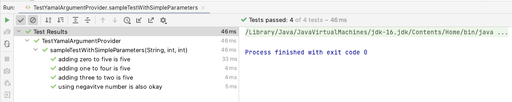

== Yamaletdt -- JUnit 5 Parameterized Tests Using Yaml and Jamal

=== Introduction and usage

You can create parameterized unit tests fetching the data from Yaml formatted resource file using Yamaledt.
To use the possibility add the dependency to your build configuration.
In case of Maven, for example, add the following lines to your `dependencies` configuration part:

[source,xml]
----
<dependency>
    <groupId>com.javax0.yamaledt</groupId>
    <artifactId>yamaledt</artifactId>
    <version>1.0.0-SNAPSHOT</version>
    <scope>test</scope>
</dependency>
----

The next step is to create a parameterized test, and the Yaml file that holds the data set for the tests.

[source,java]
----
    @ParameterizedTest(name = "{0}")
    @Jamal(enabled = false)
    @YamlSource
    void sampleTestWithSimpleParameters(@Name("DisplayName") String dn,
                                        int i,
                                        @Name("k") int k) {
        Assertions.assertEquals(5, i + k);
    }

----

The JUnit 5 annotation `@ParameterizedTest` signals that this test is a parameterized test.
The annotation `@YamlSource` specifies the test data source.
In this case all the settings are the default, there are no arguments.
The data will be read from the resource file `sampleTestWithSimpleParameters.yaml`.
The name is calculated from the name of the test method and the extension `.yaml` is appended to it.

NOTE: The extension by default is `.yaml.jam`.
In the example above we disabled the Jamal processing and therefore the default extension became `.yaml`.
Using Jamal macros in the test data file is an advanced topic.
We do not detail it in the introduction section.

The Yaml data source file contains the data in the format:

[source,yaml]
----
"adding zero to five is five":
  int: 5
  k: 0
"adding one to four is five":
  int: 4
  k: 1
"adding three to two is five":
  k: 3
  int: 2
"using negavitve number is also okay":
  k: -1
  int: 6
----

The Yaml file describes a Map structure.
The keys are the test names.
These are the strings that will get into the place of the strings, which are defined using the `@DisplayName` annotation in non-parameterized tests.
The value for each key/test is also a Map specifying the values for the test parameters.

The mapping of values can be based on

* the type of the method arguments, or

* the value of the annotation `@Name`.

In the example above we have three parameters.

* One is named using `@Name("DisplayName")`,

* one unnamed, and

* one named using `@Name("k")`.

In the Yaml file the main key, is used for the parameter named 'DisplayName'.
For the unnamed parameter the type is used, which is, in this case is `int`.
Finally, the last parameter gets the value from the map using the key `k`.

Running this test from an IDE will result a view something like this:

